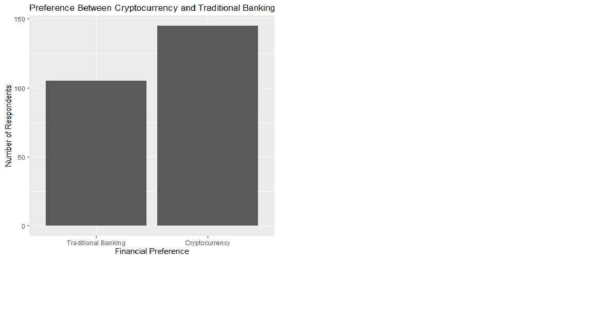
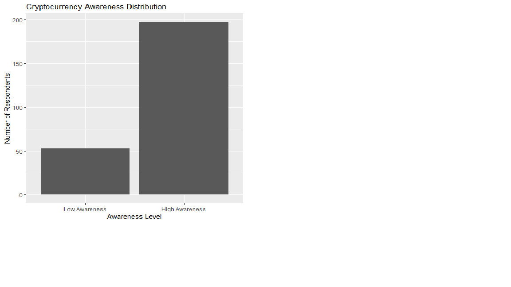
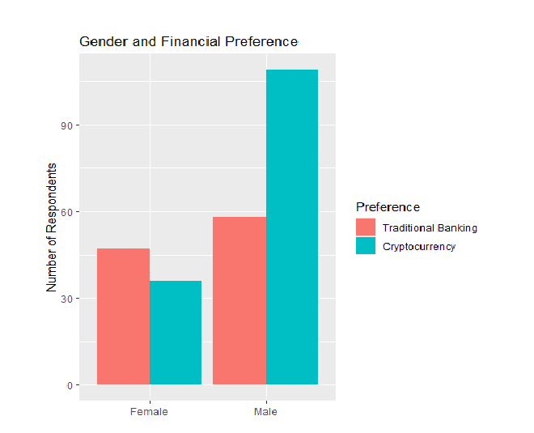

# Results and Findings

## Introduction

This study examined the preference of Nigerian youths between cryptocurrency and traditional banking systems using survey responses collected from students within three departments in the Faculty of Physical Sciences, University of Ilorin.

The primary objective of the analysis was to determine whether cryptocurrency adoption among Nigerian youths reflects a meaningful shift in financial preference and to identify the major behavioural and demographic factors influencing that preference.

To achieve this objective, the dataset underwent preprocessing and restructuring procedures before statistical modelling. Several categorical responses were standardized and grouped into broader behavioural categories to improve interpretability and statistical stability within the regression model.

The cleaned dataset was analysed using binary logistic regression in R. Additional statistical procedures including odds ratio analysis, Variance Inflation Factor (VIF) assessment, and the Hosmer–Lemeshow goodness-of-fit test were also conducted to evaluate model reliability and explanatory performance.

---

# Exploratory Data Analysis

## Financial Preference Distribution

The distribution of financial preference among respondents showed that cryptocurrency preference exceeded traditional banking preference within the sampled population.

This finding suggests that cryptocurrency adoption and interest among Nigerian youths within the study group is substantial rather than marginal. The result provides early descriptive evidence supporting the growing popularity of cryptocurrency-related financial systems among younger populations.

---

## Cryptocurrency Awareness Distribution

The awareness distribution revealed that a large majority of respondents reported high levels of cryptocurrency awareness, while comparatively fewer respondents reported low awareness.

This result is important because awareness later emerged as the strongest predictor within the logistic regression model. The descriptive distribution therefore aligns closely with the inferential findings obtained during statistical modelling.

---

## Gender and Financial Preference

The relationship between gender and financial preference indicated that male respondents demonstrated a stronger preference toward cryptocurrency compared to female respondents, while female respondents showed relatively greater preference toward traditional banking systems.

This behavioural difference later became statistically significant within the regression model and contributed meaningfully to explaining cryptocurrency preference among respondents.

---

## Cryptocurrency Risk Perception

The perceived cryptocurrency risk distribution showed that most respondents associated cryptocurrency with relatively low levels of risk, while a smaller proportion perceived cryptocurrency as highly risky.

This finding supports the later regression result where higher perceived cryptocurrency risk reduced the likelihood of cryptocurrency preference among respondents.

---

# Logistic Regression Analysis

A binary logistic regression model was developed to examine the factors influencing preference between cryptocurrency and traditional banking among Nigerian youths.

The regression model included the following predictor variables:

- Cryptocurrency awareness
- Age
- Gender
- Preference-related behavioural factors
- Perceived cryptocurrency risk

The dependent variable represented respondents' preferred financial system.

The regression analysis revealed that cryptocurrency awareness emerged as the strongest predictor within the model. Respondents with higher cryptocurrency awareness were significantly more likely to prefer cryptocurrency over traditional banking systems.

Gender also demonstrated statistical significance within the model, indicating that male respondents were more likely to prefer cryptocurrency compared to female respondents.

Perceived cryptocurrency risk displayed a statistically significant negative relationship with cryptocurrency preference. Respondents who associated cryptocurrency with higher levels of financial or security risk were less likely to prefer cryptocurrency-related financial systems.

In contrast, age and generalized preference-related motivational factors did not demonstrate statistically significant effects within the model. This suggests that awareness and risk perception exerted stronger influence on financial preference behaviour than demographic age variation within the sampled youth population.

---

# Odds Ratio Interpretation

Odds ratio analysis further strengthened the interpretation of the regression model.

Cryptocurrency awareness produced the largest effect within the model, with respondents displaying substantially higher likelihood of preferring cryptocurrency when awareness levels increased.

Gender also demonstrated meaningful influence, with male respondents showing greater likelihood of cryptocurrency preference compared to female respondents.

Perceived cryptocurrency risk produced a negative odds ratio relationship, indicating that increased perception of cryptocurrency risk reduced the probability of cryptocurrency preference among respondents.

These findings collectively suggest that behavioural exposure, familiarity, and perceived financial trust play major roles in shaping cryptocurrency adoption preference among Nigerian youths.

---

# Multicollinearity Assessment

Variance Inflation Factor (VIF) analysis was conducted to evaluate the presence of multicollinearity among predictor variables included within the regression model.

All predictor variables recorded VIF values close to 1, indicating the absence of problematic multicollinearity or redundancy among explanatory variables.

This result supports the stability and reliability of the estimated regression coefficients and suggests that each predictor contributed relatively independent information to the model.

---

# Model Fit Evaluation

The Hosmer–Lemeshow goodness-of-fit test was conducted to evaluate the adequacy of the logistic regression model.

The test produced a non-significant result, indicating no strong evidence of poor model fit. This suggests that the predicted probabilities generated by the logistic regression model were reasonably consistent with the observed preference outcomes within the dataset.

The result supports the overall reliability and adequacy of the regression model used in the study.

---

# Conclusion

The findings from this study provide evidence that cryptocurrency preference among Nigerian youths within the sampled population is substantial and behaviourally meaningful.

Cryptocurrency awareness emerged as the strongest determinant influencing preference toward cryptocurrency-related financial systems, while perceived cryptocurrency risk reduced preference likelihood. Gender differences also contributed significantly to explaining cryptocurrency preference behaviour.

Overall, the study suggests that informational exposure, familiarity, and perceived financial trust are major behavioural drivers influencing cryptocurrency adoption among Nigerian youths.

The results further indicate that cryptocurrency adoption within the sampled population extends beyond casual awareness and reflects a meaningful shift in financial preference behaviour among respondents.
